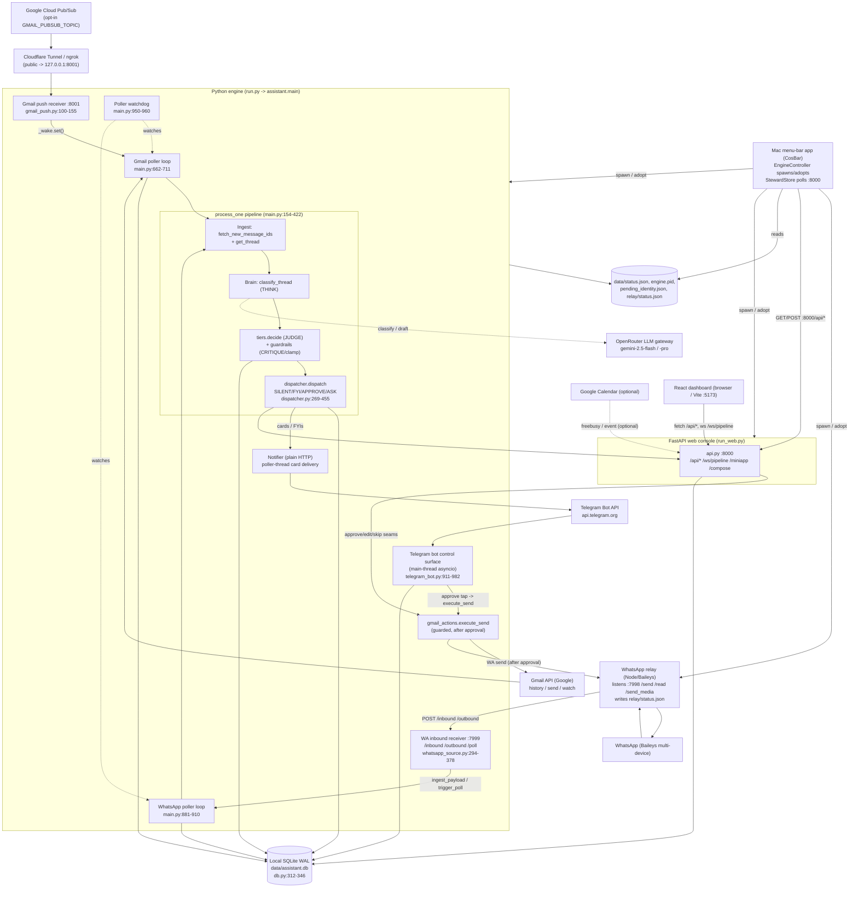

# SYSTEM_MAP.md

Deployment-destruction audit map of Steward: every entry point, worker, scheduler, queue, state machine, storage table, external dependency, process/port, HTTP endpoint, inter-process link, and the ordered per-message pipeline — each claim tied to a `file:line` citation.

## Architecture at a glance

## Entry points

| Entry point | Where | What |
|---|---|---|
| `run.py` CLI shim | `run.py:1-16` | Thin convenience entry; calls `assistant.main.main(sys.argv[1:])` and `sys.exit`s its return code. Equivalent to `python -m assistant`. |
| `main()` argparse dispatcher | `assistant/main.py:1100-1153` | Parses flags (`--onboard/--once/--status/--replay/--doctor/--export-diagnostics`), loads `Settings`, ensures dirs, sets up logging, checks `missing_required`, then routes to `run_once` or `run_full`. Read-only flags each open a DB, do one read, exit. |
| `run_full` (LIVE long-running engine) | `assistant/main.py:963-1062` | Acquires the singleton PID lock, optionally onboards, spawns the email poller + optional WhatsApp poller + watchdog, builds a `MailRouter` control surface, sends an online Telegram notice, then runs the Telegram bot on the main thread (blocking). On crash alerts the owner and re-raises; finally sets `_stop/_wake` and releases the lock. |
| `run_once` (single-pass debug) | `assistant/main.py:1065-1077` | Opens DB, recovers stale ledger rows, builds `GmailSource`, does one `poll_and_process` pass + `maybe_send_briefs`, then exits. No threads, no bot. |
| Gmail Pub/Sub push receiver | `assistant/ingest/gmail_push.py:100-155` (`PushReceiver`), wired at `main.py:88-112` (`_setup_push`) | Localhost-only (127.0.0.1) HTTP server; every POST parses the Pub/Sub envelope best-effort and calls `on_push -> _wake.set()` to wake the Gmail poller. Responds 204 fast. Touches no DB/Gmail itself. Opt-in via `GMAIL_PUBSUB_TOPIC`. |
| WhatsApp relay inbound receiver | `assistant/ingest/whatsapp_source.py:294-378` (`_InboundHandler` + `_start_receiver`) | Localhost-only HTTP server on `whatsapp_relay_port`. `POST /inbound` persists+ingests a relay payload (`ingest_payload`); `POST /outbound` records owner sends as context only (`ingest_outbound`); `POST /poll` wakes both pollers (`trigger_poll`). Optional `X-Cos-Token` auth when `INGEST_TOKEN` set (`whatsapp_source.py:312-314`). |
| Telegram bot control surface | `assistant/control/telegram_bot.py:911-982` (`build_application`/`run_bot`) | Inbound human-control surface: slash commands (`/status /pause /resume /brief /undo /declineall /wastatus /state`), inline-button taps (approve/skip/edit/draftit/ack + commitment + link-suggestion buttons), and free-text (edit drafts, name unknown contacts, compose intent, free-text commands). Only responds to the configured chat id (`_authorized`, `telegram_bot.py:100-105`). |

## Background threads & workers

| Worker | Where | What |
|---|---|---|
| Email/Gmail poller loop | `assistant/main.py:662-711` (`_poller_loop`) | Background daemon thread. Owns its own conn + `GmailSource`. Each iteration: renew Gmail watch, `poll_and_process(owns=_not_wa, do_redeliver=True)`, send briefs, run all channel-agnostic periodic jobs. Sleeps on `_wake.wait(poll_interval)`. Runs even when `EMAIL_ENABLED` is off (`mail=None`) to keep periodic jobs + heartbeat alive. |
| WhatsApp poller loop | `assistant/main.py:881-910` (`_whatsapp_poller_loop`) | Background daemon thread gated on `WHATSAPP_ENABLED`. Own conn + `WhatsAppSource` (starts the relay receiver). Each iteration `poll_and_process(owns=_is_wa, do_redeliver=False)` so it claims only `wa_*` ids and does NOT re-deliver cards (avoids double-send with the Gmail poller). Sleeps on `_wa_wake.wait(poll_interval)`. |
| `poll_and_process` (per-pass driver) | `assistant/main.py:433-472` | One poll pass: bails if paused; `fetch_new_message_ids` (errors surfaced, never crash); `ledger.mark_seen` each id; iterate `ledger.list_pending`, apply channel owns filter, `ledger.claim`, then `process_one`; on per-message exception surface to owner + `ledger.fail`. Primary poller also runs `redeliver_undelivered`. |
| `process_one` (full per-message pipeline) | `assistant/main.py:154-422` | Runs the entire per-message pipeline for one claimed id (classify -> tier-decide -> dispatch -> `ledger.complete`) plus best-effort memory/graph/operating-state/project/opportunity side effects, each wrapped so it never breaks processing. |
| Poller watchdog | `assistant/main.py:950-960` (`_poller_watchdog`) | Daemon thread; every 30s checks each poller thread `is_alive()` and alerts the owner ONCE if a channel's processing has silently halted. |
| Telegram approve worker (send execution) | `assistant/control/telegram_bot.py:398-477` (`_handle_approve`) | On Approve tap: optimistic UI edit, then on the single-worker DB executor: record tap-latency, `repo.mark_approved` (guarded compare-and-set), route compose vs reply, `gmail_actions.execute_send`/`execute_compose_send`, `record_approve`, capture commitments + post-send distill. Returns sent/already/failed, shows Retry on failure. |
| `redeliver_undelivered` (card re-delivery) | `assistant/main.py:475-498` | Re-sends pending cards (ask/approval/reminder) whose Telegram delivery previously failed so a transient outage never silently swallows something needing the owner. Reminders go as plain FYI text (never a send-able card) to avoid mis-routing to Gmail. Only the primary (Gmail) poller runs this. |

## Schedulers & timers

All scheduler dedup stamps live in the `kv` table; each block runs on a poller-loop iteration.

| Scheduler | Where | Cadence / dedup |
|---|---|---|
| `maybe_send_briefs` | `assistant/main.py:511-538` | Morning/evening briefs at configured local hours; at most once per kind per day via `kv last_brief_{kind}`; skips empty briefs. Only the Gmail poller calls it. |
| `maybe_surface_commitments` | `assistant/main.py:614-648` | Daily at `commitment_check_hour` (default 8): due/stale commitments + stalled threads, deduped via `kv last_commitment_check`. Channel-agnostic (Phase 11 fix for WhatsApp-only users). |
| `maybe_run_proactive` -> `proactive.run_sweep` | `assistant/main.py:714-720` + `assistant/control/proactive.py:350-399` | Once-daily curated chief-of-staff digest at/after `proactive_hour` (default 9), self-deduped via `kv last_proactive_sweep`. Also runs `_relationship_reminder_sweep` which creates pending reminder cards. |
| `maybe_rebuild_voice` | `assistant/main.py:550-575` | Weekly (Sunday 19:00 local), at most once per ISO week (`kv last_voice_rebuild`): rebuilds per-segment voice profiles + learned WhatsApp style. |
| `maybe_aggregate_metrics` | `assistant/main.py:578-595` | Nightly at 23:00 local, once/day (`kv last_metrics_aggregate`): pre-aggregates dashboard metrics so `/metrics` stays O(1). |
| `maybe_calibrate` | `assistant/main.py:753-764` | Once/day (`kv last_calibration`, day-key from local `datetime.now()`): recomputes confidence calibration from decisions + outcomes. |
| `maybe_nightly_sync` | `assistant/main.py:767-781` | Once/day (`kv last_graph_sync`): syncs all persons into the relationship graph so graph features reflect the full roster. |
| `maybe_decay_memory` | `assistant/main.py:784-798` | Once/day (`kv last_memory_decay`), gated on `memory_governance_enabled`: decays unreinforced memory-fact confidence (never a guardrail floor). |
| `maybe_prune` | `assistant/main.py:801-812` | Once/day (`kv last_prune`): trims unbounded high-volume tables via `storage.retention.prune`. |
| `maybe_daily_state_update` | `assistant/main.py:723-750` | Daily at `state_update_hour` (default 7), once/day (`kv last_state_update`): ensures operating-state tables, derives risk rows from overdue commitments. |
| Gmail watch renewal (`_maybe_renew_watch`) | `assistant/main.py:115-129` + `gmail_push.should_renew` (`gmail_push.py:72-79`) | Re-registers the Gmail Pub/Sub watch when within ~1 day of its ~7-day expiry; expiry tracked in `kv gmail_watch_expiry_ms`. Best-effort; polling covers gaps. |
| `_check_relay_health` | `assistant/main.py:815-839` | Per-iteration (when WhatsApp on): reads `relay/status.json`, alerts ONCE when the relay goes stale/disconnected and once on recovery, deduped via `kv relay_unhealthy_alerted`. |
| `_reap_stuck_sends` | `assistant/main.py:842-855` | Per-iteration: flags pending actions wedged in `SENDING` longer than `stuck_send_minutes`, moving them to terminal `SEND_STUCK` (never re-sent) and alerting the owner to verify. |

## Queues & buffers

| Queue / buffer | Where | What |
|---|---|---|
| `processed_messages` (exactly-once ledger) | `assistant/storage/db.py:19-32` (schema) + `assistant/storage/ledger.py` | THE primary cross-channel work queue. One row per channel message id (PRIMARY KEY). State `SEEN->PROCESSING->DONE/FAILED`. `mark_seen` (INSERT OR IGNORE) is the dedup gate; `claim` is the atomic `SEEN/PROCESSING->PROCESSING` compare-and-set (rowcount==1 = ownership); `list_pending` feeds the poller; `record_skipped` writes DONE atomically so a concurrent poller can never grab an intake-skipped group message. |
| `whatsapp_inbox` (durable WA intake + settling buffer) | `assistant/ingest/whatsapp_source.py:241-271` (`ingest_payload`), `:404-487` (fetch/settling) | Persists every raw WhatsApp payload BEFORE processing (crash-safe). status `new->queued->folded`. `plan_settling` (`whatsapp_source.py:72-127`) debounces line-by-line bursts per jid until quiet (settle window) or a max-hold cap, collapsing a burst into one representative id (earlier lines folded) so the owner gets one card per conversation. Folded members reassembled in `get_thread` (`whatsapp_source.py:544-563`). |
| `pending_actions` (human-decision queue) | `assistant/storage/db.py:38-65` (schema) | Items awaiting the owner's tap. `idempotency_key` UNIQUE = same (message,tier/kind) never queued twice. status `PENDING|APPROVED|SENDING|SENT|EDITED|SKIPPED|SEND_FAILED|EXPIRED`. The send path uses a status compare-and-set (`APPROVED->SENDING` via `begin_send`) so a double tap/restart can't double-send. kinds `reply_draft|fyi|ask|reminder|compose`. Supports card-folding (`folded_message_ids`, `message_count`) within a 20-min window (`dispatcher._maybe_fold`, `dispatcher.py:244-266`). |
| Telegram long-poll update queue | `assistant/control/telegram_bot.py:965-981` (`run_polling`) | python-telegram-bot's long-poll update stream is the inbound event source for human taps/messages. `drop_pending_updates=True` discards downtime backlog; `bootstrap_retries=-1` retries forever on startup network blips so the whole engine doesn't die. |

## State machines

| State machine | Where | Transitions |
|---|---|---|
| Ledger message state machine | `assistant/storage/ledger.py:1-129` | `(absent)->SEEN (mark_seen)->PROCESSING (claim)->DONE (complete)` or `->FAILED (fail)`. `recover_stale` (`ledger.py:110-129`) on startup re-queues PROCESSING rows to SEEN (or FAILED after `>=max_attempts=5`) so a crash mid-task is recovered without losing or poison-looping a message. Re-processing is safe because the autonomous path is idempotent/reversible; the one irreversible action (send) is gated separately. |
| Pending-action send state machine | `assistant/storage/db.py:38-59` + `telegram_bot.py:427-458` + `main.py:842-855` | `PENDING ->(mark_approved guarded) APPROVED ->(begin_send compare-and-set) SENDING -> SENT`, with `SKIPPED/EDITED/SEND_FAILED/EXPIRED` branches. A stale/re-delivered Approve tap on an already SENT/SENDING/SKIPPED row fails `mark_approved` and never reaches `execute_send` (`telegram_bot.py:426-428`). Crash mid-SENDING is reaped to terminal `SEND_STUCK`, never re-sent. |
| Tier routing state machine (dispatcher) | `assistant/action/dispatcher.py:269-455` | `FinalDecision.final_tier` in `{SILENT(0),FYI(1),APPROVE(2),ASK(3)}` routes to distinct effects: SILENT = reversible silent action, no ping; FYI = optional reversible action + one-line FYI (idempotent via `has_action`); APPROVE = draft+quality-gate+queue `reply_draft`+send Approve/Edit/Skip card; ASK = draft suggestion+queue ask+send Draft/Noted card. `idempotency_key=message_id:tier` (`dispatcher.py:232-236`). |
| Operating-state thread status | `assistant/main.py:365-383` | After each message the thread's operating-state status is set from the final tier: tier 3 -> `awaiting_me`, tier 1/2 -> `awaiting_them`, else `quiet` (`threads` table). Best-effort, never crashes the pipeline. |
| Cross-channel identity-link suggestion state | `assistant/storage/db.py:226-237` (`person_link_suggestions`) + `telegram_bot.py:575-594` | A weak person match becomes a pending suggestion; `linkyes` confirms (merges identifiers), `linkno` records `status='rejected'` so the same pair is never asked again. |

## Storage tables (with owning module)

Single-file WAL SQLite database (`data/assistant.db`, `db.py:312-346`) is the durable spine.

| Table(s) | Owning module / where | What |
|---|---|---|
| `processed_messages` | `assistant/storage/db.py:19-32`; `turn_id` migration at `migrations.py:178-186` | The exactly-once ledger (`message_id` PK, state, tier, category, confidence, dry_run, attempts, last_error). `turn_id` ties a settled WhatsApp burst together. |
| `pending_actions` | `assistant/storage/db.py:38-65`; migrations add `criticality_signal/batch_id/folded_message_ids/message_count/compose_meta/response_via` at `migrations.py:43-66` | Human-decision queue; `idempotency_key` UNIQUE; `status` field drives the send state machine; `compose_meta` holds a compose card's send target as JSON. |
| `audit_log` | `assistant/storage/db.py:69-82` | Append-only audit of every autonomous/surfaced action (archive/label/send/fyi/surface/undo). `undo_data` JSON enables reversal; `dry_run` recorded per row. |
| `contacts` | `assistant/storage/db.py:85-98`; `median_response_seconds` migration at `migrations.py:162-164` | Per-identifier profile (email/JID PK, name, relationship, importance, flags comma-list incl. vip/personal/mute, reply_rate, avg_response_seconds). flags drive VIP/personal/mute guardrails; `avg_response_seconds` feeds per-jid WA settling windows. |
| `rules` / `proposed_rules` | `assistant/storage/db.py:102-115, 167-176` | Standing preferences (`active|proposed|retired`). Inferred rules are `proposed` and must be human-confirmed before applying (`updater.maybe_propose_rule` via `telegram_bot.py:494`); never auto-applied. |
| `voice_samples` / `voice_profiles` | `assistant/storage/db.py:118-125, 258-263` | Mined Sent-mail samples + weekly-rebuilt per-segment voice profiles for drafting in the owner's style. |
| `learning_events` | `assistant/storage/db.py:128-136` | Every human signal (`approve|edit|skip|override|undo|pause`). Read by `_feedback_deprioritized` (`main.py:135-151`) and `proactive._is_resolved` (`proactive.py:112-134`). |
| `kv` | `assistant/storage/db.py:139-142` | Key/value app state: gmail history cursor, paused flag, all scheduler dedup stamps (`last_brief_*`, `last_proactive_sweep`, `last_*`), `gmail_watch_expiry_ms`, `relay_unhealthy_alerted`, `brief_today` cache. |
| `draft_edits` / `skip_log` | `assistant/storage/db.py:147-165` | Raw feedback capture (P5c) for the learning layer: pre/post draft diffs by segment; skip reasons by tier. |
| `commitments` | `assistant/storage/db.py:181-192`; `person_id` migration at `migrations.py:75-76` | Promises the owner made (extracted from sent replies). status `open|done|snoozed|stale`; `due_date` drives the daily commitment sweep and brief bullets. |
| `persons` / `person_links` / `person_link_suggestions` | `assistant/storage/db.py:198-237`; `persons.relationship_type` migration at `migrations.py:69-71` | Cross-channel identity layer above contacts: a person aggregates emails+JIDs; `person_links` maps identifier->person; suggestions hold the ask-once merge flow. |
| `relationship_memory` | `assistant/storage/db.py:243-252` | One distilled record per person: summary/open_situations/decided/episodes/superseded JSON. Read by proactive reminder sweep (`proactive.py:289`) and structured brief (`briefs.py:215`). |
| `threads` / `projects` / `opportunities` / `risks` (operating-state spine) | `assistant/storage/db.py:266-308`; re-ensured + FTS5 `threads_fts` in `migrations.py:95-158` | Operating-state spine: thread status, project tags, detected opportunities, derived risks. FTS5 `threads_fts` is best-effort (skipped if SQLite lacks FTS5). |
| `whatsapp_inbox` / `wa_messages` | referenced from `whatsapp_source.py:39-40`; migrations add `opaque` (`migrations.py:171-174`) + `wa_messages.media_type` (`migrations.py:80-83`) | Durable WA intake buffer (`whatsapp_inbox`) + full inbound/outbound history (`wa_messages`) used for context, presence, and style learning. Schemas defined in their own modules, patched here. |

## External dependencies

| Dependency | Where | What |
|---|---|---|
| OpenRouter LLM gateway | `assistant/config.py:80-86, 280-286`; consumed via `assistant.llm.client.LLMClient` (instantiated `main.py:970`); web path `api.py:155-161` | OpenAI-compatible gateway (default `google/gemini-2.5-flash` for judge/noise/draft, `gemini-2.5-pro` for critical, configurable transcribe model). Used for classification, drafting, brief prose, voice-note transcription, image description, distillation, project/opportunity detection. Drafting is fail-safe (returns a holding draft on failure so cards are never blocked). Required key `OPENROUTER_API_KEY` gates onboarding (`AppConfig.swift:93-97`). |
| Gmail API (Google client) | `assistant/ingest/gmail_source.py:21-26` + `gmail_auth.build_service`; `gmail_push.py:82-94`; web `get_mail` at `api.py:126-144` | History API incremental fetch with 404/expired fallback to `in:inbox newer_than:1d` resync; full-thread fetch; archive/label/undo via `messages.modify`; RFC2822 threaded send via `messages.send`; `users().watch` for push. Scope `gmail.modify` (+ `calendar.readonly` only when `CALENDAR_ENABLED`). Live sends only via `GmailSource.connect()` (constructed in live mode only). |
| Telegram Bot API | `assistant/control/telegram_bot.py:45-53, 965-981`; `notifier.py:35,140-184` (`Notifier` at `main.py:971`) | python-telegram-bot v21 long polling is the human-control surface (taps + free text); the `Notifier` (plain HTTP `https://api.telegram.org/bot{token}/{method}`, used by poller threads to avoid cross-thread asyncio) delivers cards, FYIs, error alerts, briefs, commitment/link/reminder prompts. A 409 Conflict (two pollers) is surfaced once (`on_error`, `telegram_bot.py:884-905`). Also validates Mini App `initData` HMAC (`miniapp_auth.py:28-93`). |
| Google Cloud Pub/Sub (push) | `assistant/ingest/gmail_push.py:1-94`; setup banner `main.py:72-85`; config `config.py:299-300` | OPT-IN (`GMAIL_PUBSUB_TOPIC`). Gmail watch publishes INBOX-change notifications to a topic; a tunnel forwards them to the localhost `PushReceiver`, which only wakes the poller. Duplicate pushes are harmless (history fetch + ledger dedup). Absent = polling-only fallback. |
| Node WhatsApp relay (Baileys) | `assistant/ingest/whatsapp_source.py:1-13, 582-605` (`_relay`/`send_media`); status at `main.py:815-839` (`relay/status.json`); session `relay/whatsapp_relay.js:13-18,469-474` | External Node process holding the Baileys WhatsApp session (paired once via QR, persisted to `relay/session/`). POSTs inbound to the Python receiver; Python POSTs `/send`, `/read`, `/send_media` back over `127.0.0.1:<send_port>`. Read receipts gated by quiet hours (`whatsapp_source.py:632-644`). Relay health monitored via `relay/status.json`. |
| Google Calendar (optional) | `assistant/web/api.py:881-938` (`_calendar.*` via `calendar_actions`) | Free/busy lookup, meeting-time proposals, event creation — only when `calendar_enabled`; each endpoint guards on the module being importable (503 otherwise). |
| macOS Contacts | `assistant/web/api.py:960-974` (`_run_startup_sync -> phone_contacts.sync`) | Best-effort startup sync of the owner's macOS Contacts into the `contacts` table (background daemon thread on API import). |
| Cloudflare Tunnel / ngrok (optional) | `assistant/ingest/gmail_push.py:16-19` (setup banner note) | Required to expose the localhost Gmail push receiver (127.0.0.1:8001) to the public Pub/Sub push subscription. Not invoked by repo code but load-bearing when push is enabled. |
| Local SQLite (WAL) | `assistant/storage/db.py:312-346` | Single-file WAL database (`data/assistant.db`) is the durable spine for the ledger, queues, memory, and all state. Authoritative; must not be opened/queried during this audit. |
| Local filesystem status/lock/identity artifacts | `main.py:858-878` (`status.json`), `main.py:913-947` (`engine.pid` lock), `dispatcher.py:217-229` (`data/pending_identity.json`), `relay/status.json` | `data/status.json` heartbeat for the Mac app; `data/engine.pid` singleton lock; `data/pending_identity.json` bridges an unknown-contact card to a later `name: X` reply; `relay/status.json` relay health. |

## Processes & network ports

### Processes

| Process | Role | Language | Where |
|---|---|---|---|
| WhatsApp relay (Node/Baileys) | Dumb pipe between WhatsApp and the Python engine: holds the paired WA session, forwards inbound to Python `/inbound`, accepts `/send /read /send_media /resolve-lid /contacts`. No triage/drafting. | Node.js (ESM, `@whiskeysockets/baileys`) | `relay/whatsapp_relay.js:1-614`; launched by `mac/Sources/CosBar/EngineController.swift:58-62` |
| Python engine (`run.py`) | The brain. Runs the Gmail + WhatsApp pollers, classifier/tiering, drafting, exactly-once ledger, guarded send seams. Hosts the WhatsApp inbound HTTP receiver and `/poll` in-process. | Python | `assistant/main.py`; receiver `whatsapp_source.py:371-381`; launched by `EngineController.swift:49-52` |
| FastAPI web console (`run_web.py`) | Local read/write console. Reads hit `read_queries`; writes route through `assistant.web.service` guarded seams (approve/edit/skip). Serves the built React dashboard at `/` and a WS pipeline feed. | Python (FastAPI/uvicorn) | `assistant/web/api.py:63, :977-981`; launched by `EngineController.swift:53-54` |
| Gmail push receiver | Opt-in localhost HTTP receiver. Every Pub/Sub push POST wakes the Gmail poller; touches no DB/Gmail. Only runs when `GMAIL_PUBSUB_TOPIC` is set. | Python (`http.server.ThreadingHTTPServer`) | `assistant/ingest/gmail_push.py:100-145`; started at `main.py:102-103` |
| Mac menu-bar app (CosBar) | Native SwiftUI supervisor + console UI. Spawns/adopts the engine, web, and relay processes; polls the console API; edits `.env` for channel toggles. Never duplicates engine logic. | Swift (SwiftUI/AppKit) | `EngineController.swift:42-72`; `StewardStore.swift:159-552`; `AppConfig.swift:7-102` |
| Vite dev server (frontend) | Dev-only React dashboard host; proxies `/api` and `/ws` to `127.0.0.1:8000`. In production the same React build is served by FastAPI at `/`. | JavaScript (Vite/React) | `assistant/web/frontend/src/api.js:1, :85`; CORS allow-list at `api.py:68` |

### Network ports (all 127.0.0.1 / localhost-bound)

| Port | Iface | Listener | Where |
|---|---|---|---|
| 8000 | 127.0.0.1 | FastAPI/uvicorn web console; serves `/api/*`, `/ws/pipeline`, `/miniapp/auth`, `/compose`, `/calendar/*`, and the static React build at `/`. | `assistant/web/api.py:981` (`uvicorn.run host='127.0.0.1', port=8000`) |
| 7999 (`WHATSAPP_RELAY_PORT`) | 127.0.0.1 | Engine WhatsApp inbound receiver `_InboundHandler`; serves `POST /inbound`, `POST /outbound`, `POST /poll`. | `whatsapp_source.py:374` `ThreadingHTTPServer(('127.0.0.1', whatsapp_relay_port))`; default 7999 `config.py:171` |
| 7998 (`WHATSAPP_SEND_PORT`) | 127.0.0.1 | Node relay send server; serves `POST /send, /read, /send_media, /resolve-lid` and `GET /contacts, /resolve-lid`. | `relay/whatsapp_relay.js:460` `server.listen(SEND_PORT, '127.0.0.1', ...)`; default 7998 `config.py:172` |
| 8001 (`GMAIL_PUBSUB_PORT`) | 127.0.0.1 | Gmail Pub/Sub push receiver; POST wakes poller, GET is a health check. Only bound when `GMAIL_PUBSUB_TOPIC` is set. | `gmail_push.py:140` `ThreadingHTTPServer(('127.0.0.1', self.port))`; default 8001 `config.py:300` via `main.py:102` |
| 5173 | 127.0.0.1 (dev only, Vite) | Vite dev server for the React dashboard (not bound by repo code; whitelisted as a CORS origin by the API). | `assistant/web/api.py:68` `allow_origins=['http://127.0.0.1:5173','http://localhost:5173']` |

## HTTP endpoints

### Web console API (FastAPI, :8000) — mutating

CSRF guard: non-localhost `Origin` -> 403; optional `CONSOLE_TOKEN` via `X-Cos-Token`. Middleware only fires on POST/PUT/PATCH/DELETE (`api.py:80-105`, guard at `:92`).

| Method | Path | Calls | Where |
|---|---|---|---|
| POST | `/api/actions/{action_id}/approve` | `service.approve -> repo.mark_approved (guard) -> gmail_actions.execute_send (begin_send guard, dry-run aware) -> recorder.record_approve`. Takes NO body so CORS does not preflight it — the Origin/host check is the only guard against a malicious page triggering a real send. | `api.py:495-504`; `service.py:25-53`; middleware `api.py:80-105` |
| POST | `/api/actions/{action_id}/edit` | `service.edit -> repo.set_pending_draft (guard, refuses terminal rows) -> recorder.record_edit` | `api.py:507-509`; `service.py:56-68` |
| POST | `/api/actions/{action_id}/skip` | `service.skip -> repo.mark_skipped (guard) -> recorder.record_skip -> updater.maybe_propose_rule` | `api.py:512-514`; `service.py:71-82` |
| POST | `/api/decisions/clear` | loops `repo.open_pending -> service.skip` (guarded skip seam) per item | `api.py:430-440` |
| POST | `/api/pause`, `/api/resume` | `repo.set_paused(conn, True/False)` — the real agent on/off | `api.py:226-237` |
| POST | `/api/command` | `commands.apply_command` (same closed-set NL handler as Telegram; never sends, never raises) | `api.py:261-270` |
| POST | `/api/fetch-now` | urllib POST to `http://127.0.0.1:{whatsapp_relay_port}/poll` -> engine `_InboundHandler` -> `main.trigger_poll` (wakes pollers, sends nothing) | `api.py:273-291`; engine handler `whatsapp_source.py:300-307` |
| POST | `/api/resolve-lid` | urllib POST to `http://127.0.0.1:7998/resolve-lid` (relay) -> `sock.onWhatsApp`; on hit writes `contacts`. **Relay port hardcoded 7998, not from settings.** | `api.py:302-334` |
| POST | `/api/sync-contacts` | `phone_contacts.sync(conn)` which GETs relay `:7998/contacts` | `api.py:294-299`; `phone_contacts.py:11,31` |
| POST | `/api/email/{message_id}/feedback` | `service.feedback -> recorder.record_override (+ maybe_propose_rule)` | `api.py:517-519`; `service.py:85-113` |
| POST | `/api/commitments/{id}/done`, `/snooze` | `service.commitment_done / commitment_snooze -> commitments.mark_done / snooze`; `_invalidate` cache | `api.py:581-591`; `service.py:117-124` |
| POST | `/api/voice-profiles/rebuild` | `service.rebuild_voice -> voice.build_segment_profiles` (dry-run: no-op; live: spends tokens via LLM) | `api.py:599-603`; `service.py:164-172` |
| POST | `/api/contacts/{email}/update` | `service.update_contact -> repo.upsert_contact` (guarded upsert) | `api.py:618-622`; `service.py:149-161` |
| POST | `/api/rules/{id}/confirm`, `/reject` | `service.confirm_rule/reject_rule -> repo.set_rule_status / set_proposed_rule_status / add_rule` | `api.py:630-639`; `service.py:127-146` |
| POST | `/api/test-pipeline`, `/api/eval` | Runs full brain on synthetic input in an in-memory DB (`db.open_db(':memory:')`); mode forced to dry_run — zero side effects | `api.py:523-556, :666-700` |
| POST | `/api/notifications/clear` | `rq.clear_notifications` (cursor stamp, deletes nothing) | `api.py:255-258` |
| POST | `/compose` | `compose.compose_and_queue(intent, channel, conn, settings, llm)` — queues a draft (no auto-send); reads raw `request.json` | `api.py:819-835` |
| POST/PATCH | `/calendar/event`, `/calendar/propose`, `/opportunities/{id}/stage` | `_calendar.create_calendar_event / propose_meeting_times`; `operating_state.update_opportunity_stage` — guarded by module-None checks (503 when unavailable) | `api.py:851-868, :898-938` |

### Web console API (:8000) — read & auth

| Method | Path(s) | Auth | Calls | Where |
|---|---|---|---|---|
| GET | `/api/status, /api/stats, /api/pipeline, /api/queue, /api/decisions, /api/contacts, /api/rules, /api/trust, /api/metrics/*, /api/health, /api/diagnostics, /api/wastatus, /api/audit-log/export, /api/email/{id}, /api/explanation/{id}, /api/replay/{id}, /state/*, /opportunities, /projects, /calendar/freebusy` | **NONE** — CSRF middleware only fires on mutating methods (`api.py:92`). Any local process or web page can read full inbox/decision/diagnostics data. | `read_queries.*` / `diagnostics.collect` (secrets redacted) / `explanations` / `replay` / `state_engine` / calendar freebusy | `api.py:221-491, :796-895` |
| GET/WS | `/ws/pipeline` | **NONE** (localhost-only bind is the only control) | loops `rq.get_pipeline(conn)` every 2s, pushes on change | `api.py:740-769`; frontend `api.js:82-93` |
| POST | `/miniapp/auth` | **Not** behind CSRF/CONSOLE_TOKEN — authenticates via Telegram `initData` HMAC-SHA256 (`validate_init_data`) keyed on bot token; rejects data >300s old; issues a 1h HMAC session token. Telegram's webview sends no Origin header so the host check passes. | `validate_init_data(init_data, bot_token) -> create_session_token` | `api.py:772-793`; `miniapp_auth.py:28-128` |

### Engine WhatsApp receiver (:7999)

| Method | Path | Auth | Calls | Where |
|---|---|---|---|---|
| POST | `/inbound` | Opt-in `INGEST_TOKEN` via `X-Cos-Token` (empty by default => unauthenticated). Localhost bind. | `ingest_payload(conn, settings, payload)` -> exactly-once ledger + queue | `whatsapp_source.py:308-337`; token check `:312-315`; relay sends it at `whatsapp_relay.js:270-284` |
| POST | `/outbound` | Opt-in `INGEST_TOKEN`; localhost bind | `ingest_outbound(conn, payload)` — owner's own message recorded as context/presence/style only, never processed | `whatsapp_source.py:325-329`; relay `whatsapp_relay.js:289-300` |
| POST | `/poll` | **NONE** by design (no body, no token); localhost bind. Triggers fetch/process only, never a send. | `main.trigger_poll()` — wakes both pollers | `whatsapp_source.py:300-307` |

### Node relay (:7998)

| Method | Path | Auth | Calls | Where |
|---|---|---|---|---|
| POST | `/send, /read, /send_media, /resolve-lid` | **NONE** (localhost bind only). `/send` performs a REAL WhatsApp `sendMessage` after a 2-8s jitter. | `sock.sendMessage / sock.readMessages / downloadBuffer+sendMessage / sock.onWhatsApp`; engine calls via `whatsapp_send_port` | `relay/whatsapp_relay.js:373-450`; engine caller `whatsapp_source.py:597,638` |
| GET | `/contacts, /resolve-lid` | **NONE** (localhost bind only) | dumps `contactNameCache` + `lidToJidMap`; resolves a LID from the in-memory map | `relay/whatsapp_relay.js:340-363` |

### Gmail push receiver (:8001)

| Method | Path | Auth | Calls | Where |
|---|---|---|---|---|
| POST/GET | `/` | **NONE** — but reached from the public internet via a cloudflared/ngrok tunnel pointing at `127.0.0.1:8001`. Any POST wakes the poller; no signature verification of the Pub/Sub envelope. | `parse_pubsub_push -> on_push(hid) -> _wake.set()`; responds 204 | `gmail_push.py:114-145`; tunnel exposure note `gmail_push.py:16-19` |

## Inter-process links

| From | To | Via | Where |
|---|---|---|---|
| WhatsApp relay (Node, :7998 client) | Engine inbound receiver (:7999) | HTTP POST `http://127.0.0.1:7999/inbound` (and `/outbound`) with optional `X-Cos-Token=INGEST_TOKEN`; on failure buffers to `relay/outbox/` and retries every 20s | `relay/whatsapp_relay.js:34-35,277-333`; receiver `whatsapp_source.py:308-337` |
| Engine (`WhatsAppSource` / `phone_contacts`) | WhatsApp relay (:7998) | HTTP POST `/send /read /send_media /resolve-lid` and GET `/contacts` to `http://127.0.0.1:7998` — the only path that actually sends WhatsApp messages (after human approval) | `whatsapp_source.py:597,638`; `relay/whatsapp_relay.js:373-450`; `phone_contacts.py:31` |
| Web console (FastAPI :8000) | Engine inbound receiver (:7999) | HTTP POST `http://127.0.0.1:{whatsapp_relay_port}/poll` for the "Fetch everything" button (wakes pollers, no send) | `api.py:281-288`; engine handler `whatsapp_source.py:300-307` |
| Web console (FastAPI :8000) | WhatsApp relay (:7998) | HTTP POST `http://127.0.0.1:7998/resolve-lid` (port hardcoded, not from settings) and GET `:7998/contacts` via `phone_contacts.sync` | `api.py:312`; `api.py:294-299 -> phone_contacts.py` |
| Cloud Pub/Sub (via public tunnel) | Gmail push receiver (:8001) | HTTPS push -> tunnel (cloudflared/ngrok) -> HTTP POST `127.0.0.1:8001` -> `_wake.set()` wakes the Gmail poller | `gmail_push.py:16-19,114-145`; `main.py:102-103` |
| Mac app (`EngineController`) | Engine / web / relay processes | Process spawn (`Process.run`): `.venv/bin/python run.py`, `.venv/bin/python run_web.py`, `node relay/whatsapp_relay.js`; adopts existing ones via PortCheck/heartbeat instead of duplicating | `EngineController.swift:42-72,102-123`; paths in `AppConfig.swift:28-35` |
| Mac app (`StewardStore`) | Web console API (:8000) | HTTP GET/POST to `http://127.0.0.1:8000/api/*` with optional `X-Cos-Token` from `.env CONSOLE_TOKEN`; 12s poll loop | `StewardStore.swift:191-551`; base = `AppConfig.dashboardURL` (`AppConfig.swift:23-24`) |
| Mac app (`EngineController`/`AppConfig`) | Engine + relay status files | Reads `data/status.json` and `relay/status.json` on disk (written by relay `writeStatus` every 30s) for liveness/relay health | `EngineController.swift:89-95`; `AppConfig.swift:34-35`; `relay/whatsapp_relay.js:68-78`; `read_queries.get_wastatus` at `read_queries.py:283-291` |
| React dashboard (browser) | Web console API (:8000) | `fetch /api/*` and `ws /ws/pipeline`; in dev Vite proxies from :5173, in prod served same-origin from the FastAPI static mount | `assistant/web/frontend/src/api.js:1-93`; static mount `api.py:941-957` |

## Per-message pipeline (ordered)

Driven by `poll_and_process` (`main.py:433-472`) -> `process_one` (`main.py:154-422`). `ledger.complete` is the LAST step, so a crash anywhere before it leaves the row PROCESSING for `recover_stale` to re-queue.

1. **Fetch new ids** — `main.py:447` -> `gmail_source.fetch_new_message_ids` (`gmail_source.py:67-129`) / `whatsapp_source.fetch_new_message_ids` (`whatsapp_source.py:454-487`). Gmail: History API since stored `historyId` (mark_seen each id BEFORE advancing the cursor so a crash can't skip messages; 404 -> recent resync). WhatsApp: drain `whatsapp_inbox` via `plan_settling` (debounce bursts into one representative id). Errors surfaced to owner, never crash the loop.
2. **Dedup gate (mark_seen)** — `main.py:453-454` + `ledger.mark_seen` (`ledger.py:35-46`). Every new id is INSERT OR IGNORE'd into `processed_messages` — the exactly-once gate. Already-seen ids return False and are never processed twice.
3. **Claim (ownership + channel filter)** — `main.py:456-461` + `ledger.claim` (`ledger.py:49-62`). Iterate `ledger.list_pending`; skip ids not owned by this poller's channel (`owns` filter); `ledger.claim` atomically flips `SEEN/PROCESSING->PROCESSING` (rowcount==1 = exclusive ownership). The concurrency guard between the two pollers.
4. **Fetch full thread + self/empty guards** — `main.py:159-175`. `mail.get_thread(message_id)` rebuilds the full thread; stamp `thread_id`. If no inbound -> `ledger.complete` tier 0 `other`. If sender is a self-address -> complete tier 0 `self_skipped` (never process the principal's own mail).
5. **Resolve contact + cross-channel person** — `main.py:177-198`. `memory_contacts.resolve_sender` + `observe_thread`; if `memory_enabled`, `identity.resolve` maps sender to a PERSON (best-effort, may surface a weak-match link suggestion). All memory steps degrade to thread-only on failure.
6. **Build classifier context (retrieval + enrichers)** — `main.py:199-255`. `retrieval.get_context` plus best-effort enrichers each in try/except so they never break processing: calendar note (P4a), person memory block + deterministic `memory_signals`, graph signals (waiting_on_me/neighbors), WhatsApp rolling conversation (Layer 1C).
7. **Compute lowering signals (presence + feedback)** — `main.py:135-151` (`_feedback_deprioritized`), `257-272`. `presence.is_actively_handling` (WA only; owner handling it himself) and `_feedback_deprioritized` (repeated skips with ~no approvals). Both only ever LOWER surfacing, never below the guardrail floor, never for VIP/personal/high-stakes.
8. **Classify (LLM brain — THINK)** — `main.py:274-276` -> `classifier.classify_thread`. The LLM classifier produces a `Decision` (category, confidence, intent, one_line_summary, suggested_action) over the thread + assembled context.
9. **Tier decision (JUDGE + guardrails)** — `main.py:277-279` -> `tiers.decide`. `decide_tier` folds `Decision` + contact + `TierConfig` + memory/presence/feedback signals into a `FinalDecision` (final_tier, base_tier, surfaced_reason). Guardrails clamp (personal->Tier3, VIP-instant, mute floor, high-stakes floor) and enforce no-auto-send.
10. **Persist decision + explanation + replay** — `main.py:291-313`. `decision_log.record` (drives the console + "nearly filed" stat), `explanations.record` (full why-chain), `replay.capture` (prompt versions/models/context for later reconstruction). All best-effort; explainability never breaks the pipeline.
11. **Dispatch to tier effect** — `main.py:315` -> `dispatcher.dispatch` (`dispatcher.py:269-434`). SILENT: reversible silent action only. FYI: optional reversible action + one-line FYI (idempotent). APPROVE/ASK: `draft_reply` (never raises -> holding draft) + quality gate (em-dash/fabrication flags) + maybe fold into an open same-sender card OR `create_pending` (`idempotency_key=message_id:tier`) + send the card + persist the Telegram message id. Audit `surface` row written.
12. **Post-card episodic + `ledger.complete`** — `main.py:319-330`. Record an episodic `surfaced` memory for tiers>=APPROVE, then `ledger.complete` (DONE with tier/category/confidence/dry_run). `complete` is the LAST step so a crash anywhere before it leaves the row PROCESSING for `recover_stale`.
13. **Post-DONE best-effort enrichment** — `main.py:332-422`. After completion (so it never delays the card): 1:1 relationship distill + inbound-commitment capture (GROUP-guarded for privacy), graph node/edge upsert (owner->sender knows), operating-state thread status, project auto-tagging + opportunity detection (tier>=2 only to save LLM calls). Every block is try/except.

## Concurrency model

Multi-threaded process with thread-local SQLite connections over a single WAL database file (`db.py:312-328`: WAL + `busy_timeout=30000` + `check_same_thread=False`). `run_full` (`main.py:963-1062`) is the live runner:

- The **Telegram bot owns the asyncio event loop on the MAIN thread** (`telegram_bot.run_bot -> application.run_polling`, `telegram_bot.py:965-981`) using the main-thread conn opened at `main.py:968`.
- The **Gmail/email poller runs on a BACKGROUND daemon thread** (`_poller_loop`, `main.py:662-711`) with its OWN conn (`main.py:666`).
- If `WHATSAPP_ENABLED`, a **second daemon thread** (`_whatsapp_poller_loop`, `main.py:881-910`) runs with its own conn (`main.py:887`).
- A **watchdog daemon** (`_poller_watchdog`, `main.py:950-960`) alerts once if a poller dies.

**Connection ownership rule** (`telegram_bot.py:6-32`): connections are never shared across threads; each thread opens its own. Within the bot, all blocking DB work on the shared main conn is funneled through a SINGLE-worker `ThreadPoolExecutor` (`_DB_EXECUTOR`, `telegram_bot.py:929` + `_run_db` at `108-116`) so two async handlers never touch the conn concurrently. The HTTP receivers (Gmail `PushReceiver` `gmail_push.py:100-155`, WhatsApp `_InboundHandler` via `ThreadingHTTPServer` `whatsapp_source.py:294-378`) are themselves multi-threaded (thread per request) and each request opens a fresh `db.open_db` connection (`whatsapp_source.py:323`).

Concurrency between the two pollers over the shared ledger is made safe by per-channel ownership filters (`owns=_not_wa` for Gmail `main.py:686`, `owns=_is_wa` for WhatsApp `main.py:903`) plus `ledger.claim`'s atomic compare-and-set (`ledger.py:49-62`). A PID-file singleton lock (`_acquire_singleton_lock`, `main.py:913-936`) refuses to start a second engine so two Telegram pollers can't 409-kill each other. Interruptible polling waits use `threading.Event` (`_wake` / `_wa_wake`, `main.py:53-59`) so a Gmail push or manual `/poll` wakes the poller immediately; `_stop` coordinates shutdown.
